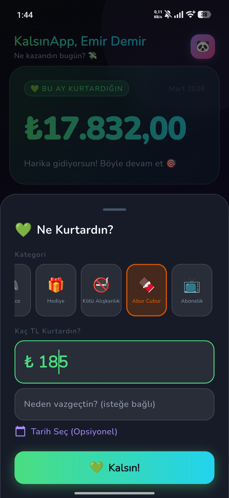
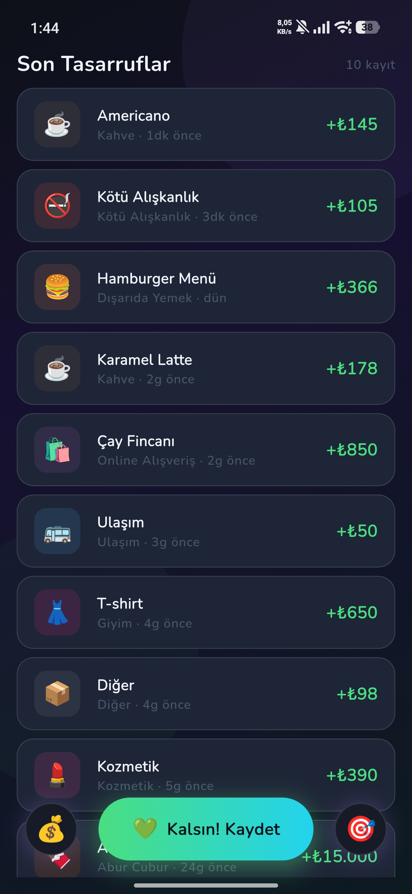

# KalsınApp


**KalsınApp** – Genç Türk kullanıcıları için yüksek sesli bütçe yönetimi ve harcama takibi uygulaması. Harcamalarınızı kontrol altına alın, tasarruf hedefleri belirleyin ve *no‑spend* günlerinizi takip edin. Uygulama, Riverpod ile yönetilen modern bir Flutter kod tabanına sahiptir ve Android ile iOS platformlarında çalışır.

## 📱 Google Play

Uygulamayı Android cihazınıza indirmek için:  
[Google Play Store – KalsınApp](https://play.google.com/store/apps/details?id=com.cebinekalsin.app)

## ✨ Özellikler

- **Bütçe ve Harcama Takibi**: Gelir ve giderlerinizi kolayca kaydedin.  
- **No‑Spend Günleri**: Harcama yapmadığınız günleri kaydedin ve istatistiklerini görün.  
- **Bildirimler**: Günlük hatırlatıcılar ve bütçe limit uyarıları.  
- **Paylaşım & Dışa Aktarım**: Verilerinizi CSV olarak dışa aktarın ve sosyal medyada paylaşın.  
- **Tema ve Font**: Google Fonts ve özelleştirilebilir temalar.  
- **Reklam Desteği**: Google Mobile Ads entegrasyonu.  
- **Widget Desteği**: Ana ekran widget'ı ile hızlı bakış.  
- **Çoklu Dil**: Türkçe ve İngilizce (i18n) destekli.

## 📸 Ekran Görüntüleri





## 🚀 Başlangıç

### Gereksinimler

- Flutter SDK `>=3.0.0 <4.0.0`
- Android Studio / Xcode (iOS geliştirme için)
- Java 11 (Android)
- Bir cihaz ya da emulator

### Kurulum

```bash
# Repoyu klonlayın
git clone https://github.com/kullaniciadi/KalsinApp.git
cd KalsinApp

# Bağımlılıkları yükleyin
flutter pub get

# Hive kod üreticisini çalıştırın (model sınıfları)
flutter pub run build_runner build --delete-conflicting-outputs
```

### Çalıştırma

```bash
# Android (emulator veya bağlı cihaz)
flutter run -d android

# iOS
flutter run -d ios
```

### Derleme

```bash
# Android APK
flutter build apk --release

# iOS App Store paket
flutter build ios --release
```

## 🤝 Katkıda Bulunma

Katkılarınızı memnuniyetle karşılıyoruz! Lütfen aşağıdaki adımları izleyin:

1. **Fork** yapın ve yeni bir branch oluşturun:
   ```bash
   git checkout -b feature/yenilik
   ```
2. Değişikliklerinizi yapın ve test edin.
3. **Pull Request** gönderin ve açıklayıcı bir başlık ekleyin.
4. Kod incelemesi ve testlerden sonra birleştirilecektir.

Kod standartları için `flutter analyze` ve `flutter test` komutlarını çalıştırın.

## 📧 İletişim

- **Geliştirici**: [Ali Emre Çaylak](https://github.com/aecaylak)
- **E‑posta**: aliemrecaylak@gmail.com

---

*Bu proje açık kaynak olarak GitHub’da barındırılmaktadır. Lütfen yıldız verin ve topluluğa katkıda bulunun!*